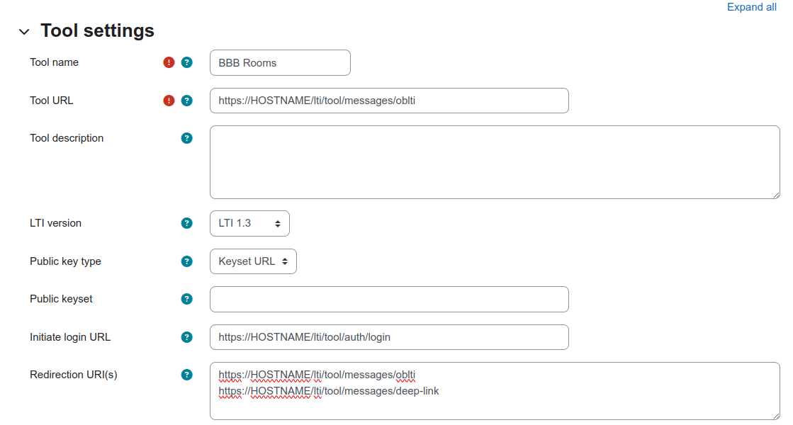
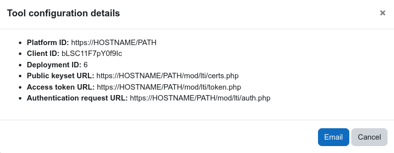
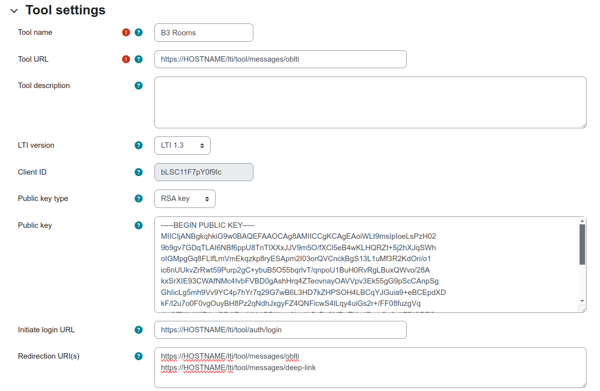

## BigBlueButton LTI Broker
The BBB LTI Broker is a Web Application that acts as a LTI Broker for connecting Tool Consumers with BigBlueButton Tools. The most basic deployment required the collaboration of two applications, the bbb-lti-broker itself and bbb-app-rooms. Being the flow:

## Getting Started
#### Use Docker
First, make sure you have both Docker and Docker-Compose installed as they are requirements.

Then, to get this running with Docker, follow these steps:
Pull the ```docker-compose.yml``` and ```dotenv``` files from the repository. Then run the following commands.
```
  docker-compose run app rake db:create
  docker-compose run app rake db:migrate
  docker-compose run app rake db:seed
  docker-compose up
```
To customize its behaviour copy the file dotenv as app.env (for development only) and uncomment the environment variables as required.

The database by default is sqlite3, even for production. Change the adapter for using postgresql and set up the rest of the parameters.

```
  # DB_ADAPTER=[sqlite3|postgresql]
  # DB_HOST=<localhost>
  # DB_NAME=
  # DB_USERNAME=<root>
  # DB_PASSWORD=
```

For changing the root (this is mandatory if you run the Tool Provider in the same box where BigBlueButton is running) and also
for making use of the brokerage capability the external Application(s) must be declared in environment variables.

```
  # App configuration
  # Define the root where the application is being mounted
  # (e.g. lti for http://example.com/lti or lti/tools for http://example.com/lti/tools)
  # RELATIVE_URL_ROOT=lti

  # LTI tools configuration
  # Define the external application to be used by default as for serving LTI launch requests.
  # DEFAULT_LTI_TOOL=<default|rooms>
```

Whitelist the URL that the broker is on

```
  # DEVELOPER_MODE_ENABLED=broker.example.com
```

There are some functions that can be enabled when setting the server into developer mode.
This includes:
  - A LTI App can be used by default for testing purposes.
  - A UI for managing OAuth2 applications is enabled [http://example.com/lti/oauth/applications].

```
  # DEVELOPER_MODE_ENABLED=true
```

The seed will set up data by default that should be changed for production. This is:
  - LTI key pair
```
  {
    :key => 'key',
    :secret => 'secret'
  }
```

## Ports
The LTI Broker uses port 3000 by default, but this can be changed by editing the docker-compose file.
Under the 'app' service the 'ports' configuration can be modified from 3000:3000 to DESIRED_PORT:3000

## Add a Tool to the LTI Broker
In order to add an LTI Tool Provider or edit an existing tool, rake commands are used.
A name for the tool, the hostname, as well as the provided UID and secret from the tool are required.
The command is ```docker-compose run app rake "db:apps:add[tool_name,hostname,tool_uid,tool_secret]"```

#### Useful Rake Commands
Rake commands should be run using the following syntax:
```
docker-compose run app rake "RAKE_COMMAND"
```
The following are some useful and relevant rake commands for the LTI Broker:
* rake db:apps:add[name,hostname,uid,secret,root]  # Add a new blti app
* rake db:apps:delete[name]                        # Delete an existent blti app if exists
* rake db:apps:deleteall                           # Delete all existent blti apps
* rake db:apps:show[name]                          # Show an existent blti app if exists
* rake db:apps:showall                             # Show all existent blti apps
* rake db:apps:update[name,hostname,uid,secret]    # Update an existent blti app if exists
* rake db:create                                   # Creates the database from DATABASE_URL or config/database.yml for the curre...
* rake db:drop                                     # Drops the database from DATABASE_URL or config/database.yml for the current...
* rake db:environment:set                          # Set the environment value for the database
* rake db:exists                                   # Checks to see if the database exists
* rake db:fixtures:load                            # Loads fixtures into the current environment's database
* rake db:keys:add[keys]                           # Add a new blti keypair (e.g
* rake db:keys:delete[keys]                        # Delete an existent blti keypair if exists (e.g
* rake db:keys:deleteall                           # Delete all existent blti keypairs
* rake db:keys:show                                # Show all existent blti keypairs
* rake db:keys:update[keys]                        # Update an existent blti keypair if exists (e.g
* rake db:migrate                                  # Migrate the database (options: VERSION=x, VERBOSE=false, SCOPE=blog)
* rake db:migrate:status                           # Display status of migrations
* rake db:prepare                                  # Runs setup if database does not exist, or runs migrations if it does
* rake db:registration:delete                      # Delete existing Tool configuration
* rake db:registration:keygen[type]                # Generate new key pair for existing Tool configuration [key, jwk]
* rake db:registration:new[type]                   # Add new Tool configuration [key, jwk]


## Link the LTI Broker to LMS

### Using LTI 1.0/1.1
There is no need to register an LTI 1.0/1.1 tool with the broker. All that the LTI Tool Consumer needs is the Broker Key and Secret. These can be set as environment variables.
There are certain fields the tool consumer will require. These fields (and example values) are:

- Tool URL => ```http://HOSTNAME/lti/TOOL_NAME/messages/blti```
- Consumer Key => ```BROKER_KEY```
- Shared Secret => ```BROKER_SECRET```

### Using LTI 1.3
#### Add an LTI 1.3 Registration
Registering a LTI 1.3 tool with the Broker can only be done manually and it is a 3-fold process.

**Prerequisite**

There needs to be certain information publicly available to Platform Administrators. That is essentially a set of constant values in the form of URLs that need to be used to register the Tool manually.

E.g. In Moodle they would matched like this:

- Tool URL: 
```
https://HOSTNAME/lti/tool/messages/oblti
```

- Initiate Login URL: 
```
https://HOSTNAME/lti/tool/auth/login
```

- Redirection URI(s):
```
https://HOSTNAME/lti/tool/messages/oblti
https://HOSTNAME/lti/tool/messages/deep-link
```


**Step 1.**

The process is started by the Platform Administrator adding a new tool to the Platform itself. 

E.g. In Moodle that would be like this:



That registration is not complete yet. And it actually is supposed to be still missing an important piece (explained in Step 3). But it allows us to have the information the Tool Administrator will need.

Since the Client is still not active in the Tool, the Tool can not be used yet by the Platform. Doing so will result in an error as the Consumer is not enabled yet by the Provider. 

**Note:** As it is right now, the launch generates an ugly error to the user of the consumer that needs to be prettyfied. The error in the logs is:

```
ERROR: The app is not currently registered within the lti broker.
Filter chain halted as :validate_oidc_login rendered or redirected
```


**Step 2.**

The process then continues with the Tool Administrator registering the Client using the rake task.



```
rake db:registration:new['https://HOSTNAME/PATH',bLSC11F7pY0f9Ic,'https://HOSTNAME/PATH/mod/lti/certs.php','https://HOSTNAME/PATH/moodle403/mod/lti/token.php','https://HOSTNAME/PATH/mod/lti/auth.php',tenant_uid]
```

The URLs in this case are also constant. But the value that is variable is the Client ID which is generated once the Platform registers the Tool.

Now, the Tool Administrator should pass to the Platform Administrator the Public Key that was generated by the rake task during the Client Registration. So the configuration can be completed on the Platform.


**Step 3.**

The step three should be for the Platform Administrator to complete the set up with the Public Key received.



This is for all the communication from the Broker to the Platform to be validated.

